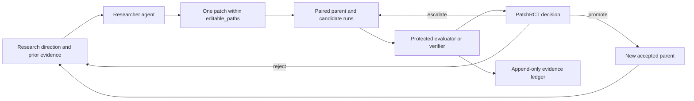

# Autodidact

Autodidact is a model-agnostic autoresearch control plane. A research agent proposes and implements
one code change, Autodidact trains the unchanged parent and candidate under matched conditions, and
PatchRCT decides whether the evidence is strong enough to promote the candidate.

The repository contains no model, dataset, checkpoint, or fixed reinforcement-learning algorithm.
You connect your own supervised, RL, or RLVR target through a protected target plugin. The
researcher can be Codex, Claude Code, Hermes Agent, or a custom command adapter.

Project site: [researchautodidact.vercel.app](https://researchautodidact.vercel.app/)

## What users configure

Autodidact separates the coding agent from the model being researched. Selecting a model for
Codex, Claude Code, or Hermes Agent does not select or download the target model.

| Layer | Configured by | What can be selected |
| --- | --- | --- |
| Researcher | `autodidact-agent bootstrap` | Agent provider, researcher model, reasoning effort, and inference limits |
| Target | Target code, plugin JSON, and `autodidact-target init` | Model/trainer files, data or tasks, device, parameter cap, commands, and protected metric |
| RL/RLVR | Plugin `rl` contract | Paradigm, reward source and range, budget unit, verifier contract, and agent-editable algorithm files |
| Compute | Target commands and target config | CPU, MPS, local CUDA GPU, or a user-managed GPU host |

The user supplies the initial target implementation and protected evaluator. After that setup, the
configured researcher may change every file declared in `editable_paths`. Put model architecture,
trainer, rollout, and algorithm files in that list only when they are intended research surfaces.
Autodidact keeps the evaluator, verifier, protected inputs, seeds, budgets, and promotion decision
outside the agent's edit boundary.

## What it controls



- **Researcher boundary:** the agent may inspect and modify only the plugin's `editable_paths`.
- **Target boundary:** the user supplies training, data or tasks, checkpoints, and device handling.
- **Evaluation boundary:** the evaluator, verifier, target contract, seeds, and budgets are protected.
- **Decision boundary:** the agent proposes code but cannot grade or promote its own patch.
- **Recovery boundary:** transcripts, reservations, runs, decisions, and lineage are durably recorded.

## RL and RLVR

An RL target declares the stable experimental facts: `rl` or `rlvr`, reward source, reward range,
budget unit, and which editable files implement the algorithm. It deliberately does **not** declare
a fixed algorithm.

For example, a plugin can expose `policy/algorithm.py` in both `editable_paths` and
`rl.algorithm_paths`. Codex, Claude Code, Hermes Agent, or another configured researcher may then
replace GRPO with PPO, implement a custom objective, change advantage estimation, or tune rollout
logic as its one proposed patch. Autodidact records the trainer-reported `algorithm_id` for each
run but does not restrict its value.

The protected contract still prevents the researcher from changing reward semantics, the verifier,
held-out tasks, seed assignment, or promotion thresholds. For RLVR, the reward source must include a
verifier, and protected evaluation must report verifier coverage and reward variance.

The agent does not configure RL by changing Autodidact itself. The target owner first declares the
RL contract and allowed files in the target plugin. Every configured researcher receives the same
contract and edit scope, so changing from Codex to Claude Code or Hermes Agent does not change the
experiment definition.

## Install

Python 3.11 through 3.13 and Git are required. Install from the repository with
[uv](https://docs.astral.sh/uv/):

```bash
git clone https://github.com/itsflownium/autodidact-autoresearch.git
cd autodidact-autoresearch
uv sync --locked
```

Autodidact can also be installed into a separate target repository:

```bash
uv add "autodidact-autoresearch @ git+https://github.com/itsflownium/autodidact-autoresearch.git"
```

Runtime configuration and evidence are written under `artifacts/` and should stay outside Git.
Credentials remain in the research-agent CLI or GPU host; Autodidact does not store API keys.

## 1. Configure a researcher

Choose one proposal agent independently from the model being researched.

### Codex

```bash
uv run autodidact-agent bootstrap \
  --provider codex \
  --model YOUR_CODEX_MODEL \
  --reasoning-effort high \
  --fix
```

### Claude Code

```bash
uv run autodidact-agent bootstrap \
  --provider claude-code \
  --model YOUR_CLAUDE_MODEL \
  --reasoning-effort high \
  --max-turns 40 \
  --fix
```

### Hermes Agent

```bash
uv run autodidact-agent bootstrap \
  --provider hermes-agent \
  --backend-provider YOUR_HERMES_BACKEND \
  --model YOUR_RESEARCHER_MODEL \
  --fix
```

Then verify the executable and local configuration without making an inference call:

```bash
uv run autodidact-agent doctor --fix
```

`doctor --fix` can locate another compatible executable, repair config permissions, and run known
package-manager repairs. It fails before inference when a CLI version no longer supports the flags
Autodidact needs.

## 2. Connect a target

Add three things to the Git repository being researched:

1. Editable trainer and algorithm files.
2. A protected evaluator adapter that implements the JSON event protocol.
3. A protected target-plugin JSON file that declares commands, paths, metric, and optional RL data.

Start from [`examples/rlvr-target-plugin.example.json`](examples/rlvr-target-plugin.example.json)
for RLVR or [`examples/target-plugin.example.json`](examples/target-plugin.example.json) for another
training paradigm. These are contracts only; they do not include a model or task implementation.

For an RLVR target, the important edit boundary looks like this:

```json
{
  "editable_paths": [
    "policy/train.py",
    "policy/model.py",
    "policy/algorithm.py"
  ],
  "evaluator_path": "control/evaluate.py",
  "rl": {
    "algorithm_paths": ["policy/algorithm.py"],
    "budget_unit": "tokens",
    "paradigm": "rlvr",
    "reward_minimum": 0.0,
    "reward_maximum": 1.0,
    "reward_source": "verifier",
    "schema_version": 1
  }
}
```

`algorithm_paths` must be a subset of `editable_paths`. Autodidact does not enumerate or force an
algorithm, so the researcher can implement GRPO, PPO, REINFORCE, or a custom method. The trainer
reports an arbitrary `algorithm_id` for evidence attribution; the protected evaluator independently
computes the reward used by PatchRCT.

Create the local target configuration:

```bash
uv run autodidact-target init \
  --name my-rlvr-target \
  --trainer-path policy/train.py \
  --plugin-spec control/target-plugin.json \
  --public-data-root /datasets/my-task/public \
  --data-root /datasets/my-task/protected \
  --device cuda \
  --execution-location gpu_host \
  --max-parameter-count 8000000000

uv run autodidact-target doctor --repository-root .
```

`public-data-root` is visible to training. `data-root` is passed only to the protected evaluator.
They must be different directories. `device` is an opaque value passed to your adapters, so a
target may support `cpu`, `mps`, `cuda`, a local consumer GPU, or a custom remote runtime.
Autodidact does not provision or SSH into that runtime.

### Target integration requirements

Before a real campaign, the target owner must provide:

1. A trainer that consumes the exact assigned `{training_budget}`, seed, public input root, and
   output paths.
2. A protected inspector/evaluator that implements Autodidact's JSON event protocol.
3. Distinct public and protected data, task, or environment roots.
4. Deterministic or seed-controlled target behavior appropriate for paired comparisons.

Run `autodidact-target doctor`, followed by a one-proposal smoke campaign, before spending on a
larger run. The included tests exercise synthetic target plugins; they are not evidence that an
unseen real trainer or verifier is integrated correctly.

### Current limits

- The autonomous CLI currently uses PatchRCT's default cheap, intermediate, and full stage budgets
  of 2,000,000, 6,000,000, and 20,000,000 target units. The campaign-wide ceiling is configurable,
  but per-stage values are not yet target-JSON fields.
- External target plugins currently start each escalated stage through a fresh trainer invocation;
  generic checkpoint continuation between stages is not yet supported. Exact compatible parent
  results can still be reused with ledger provenance.
- Third-party agent CLI flags can change. `autodidact-agent doctor --fix` detects supported versions
  and common installation problems before inference, but cannot guarantee future CLI compatibility.

## 3. Run a campaign

Keep a generic research contract such as [`program.md`](program.md) in the target repository, or
pass a different file with `--program`.

```bash
uv run autodidact-orchestrator \
  --repository-root . \
  --researcher-config artifacts/control/researcher.json \
  --target-config artifacts/control/target.json \
  --program program.md \
  --decision-mode patch_rct \
  initialize \
  --campaign-id rlvr-pilot-001 \
  --max-proposals 20 \
  --max-wall-seconds 86400 \
  --max-researcher-tokens 20000000 \
  --max-training-tokens 400000000 \
  --max-compute-seconds 86400

uv run autodidact-orchestrator \
  --repository-root . \
  --researcher-config artifacts/control/researcher.json \
  --target-config artifacts/control/target.json \
  run --max-new-proposals 1
```

Run one proposal first and inspect status before increasing the limit:

```bash
uv run autodidact-orchestrator \
  --repository-root . \
  --researcher-config artifacts/control/researcher.json \
  --target-config artifacts/control/target.json \
  status
```

Initialization pins hashes of the researcher config, target config, program, optional execution
queue, decision mode, and campaign ceilings. Repeating `run` resumes recorded work instead of
duplicating a completed researcher call or protected experiment.

## PatchRCT

PatchRCT means **Patch Randomized Controlled Trial**. For each proposed patch it compares:

- a parent arm at the currently accepted Git commit; and
- a candidate arm with exactly one agent-authored patch.

Both arms use predetermined seeds, matched budgets, the same protected metric, randomized execution
order, and resource gates. A positive gain means the candidate's canonical objective is lower than
the parent's. The Bayesian posterior estimates the probability that this gain exceeds the
proposal's predeclared minimum useful effect. PatchRCT can reject, request more paired evidence, or
promote only after full-stage evidence clears the configured probability and regression gates.

This is stricter than a single noisy keep/discard result. It costs more per difficult decision, so
Autodidact also supports a scout mode and a separately calibrated downstream reward estimator.

## Downstream reward estimation

With `--reward-calibration-labels N --use-downstream-allocation`, early paired measurements become
features for a protected Bayesian learning-curve model. After enough candidates also receive full
labels, the model can stop clearly weak candidates, gather more intermediate evidence, or allocate a
full test. Deterministic audits preserve labels needed to detect estimator drift.

The estimator allocates evaluation compute; it never promotes a patch. Final promotion still uses
direct PatchRCT evidence from the protected metric.

## Evidence and reporting

The append-only SQLite ledger records proposal claims, candidate commits, run contracts, artifacts,
paired effects, posterior decisions, resource measurements, and accepted lineage. The sealed
workflow freezes accepted lineages and evaluates them on untouched tasks after research ends.

- [Configuration](docs/configuration.md)
- [Target plugin and RL/RLVR protocol](docs/target-plugins.md)
- [Sealed evaluation](docs/sealed-evaluation.md)
- [Three-arm comparison study](docs/three-arm-study.md)

## Development

```bash
uv sync --locked --all-groups
uv run ruff check .
uv run ruff format --check .
uv run pytest -q
uv run python -m compileall -q autodidact tests
uv build
```

The tests use synthetic target plugins and do not download a dataset or train a bundled model.
