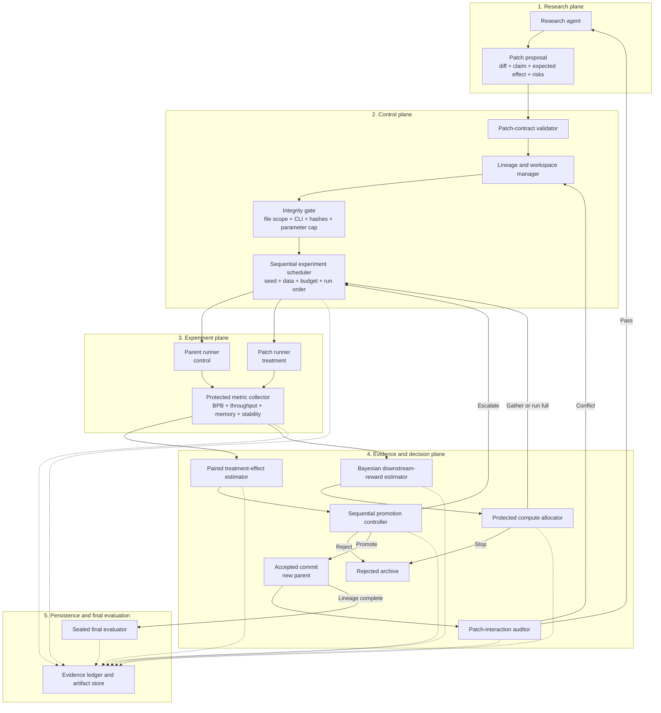

# autodidact

The idea: give an AI research agent a small but real language-model training setup and let it improve the model autonomously. The agent proposes a focused change, trains it against the current parent under matched conditions, and receives a decision: reject it, gather more evidence, or promote it.

Autodidact starts with a **1,016,960-parameter transformer** that can run locally on Apple Silicon. Larger studies can move to a single H100 without changing the research protocol. The target is not a frontier language model. It is a controlled laboratory for asking a more basic question:

> Can an autonomous research loop distinguish genuine model improvements from lucky training runs?

Autodidact builds on the compact workflow introduced by [Karpathy's autoresearch](https://github.com/karpathy/autoresearch), then adds **PatchRCT**, paired experiments, hidden evaluation, and Bayesian downstream-reward estimation.

> **Status:** the immutable data system, 1,016,960-parameter baseline, local noise calibration, protected paired runner, PatchRCT controller, downstream-reward estimator and allocation policy, generic researcher adapter, durable recovery state, autonomous orchestration loop, and frozen sealed-evaluation/reporting workflow are implemented. The three-seed, 20M-token parent baseline is complete. The real patch campaign, 40-label reward calibration, and sealed evaluation have not run, and no candidate-patch improvement is claimed.

## How it works

The core loop is deliberately small:

```text
research agent proposes an atomic patch + falsifiable claim
                              |
                              v
                 integrity and parameter checks
                              |
                              v
             parent and patch run on matched trials
                              |
                              v
          patch effect + downstream reward are estimated
                              |
                              v
                  reject / escalate / promote
                              |
                              v
             accepted patch becomes the new parent
```

The research agent proposes changes, while the protected experiment runner and PatchRCT system evaluate them. The agent does not grade its own work.

The initial implementation keeps the same useful boundary as autoresearch:

- **`prepare.py`** — fixed data preparation and integrity verification. The agent cannot modify it.
- **`train.py`** — the transformer, optimizer, and training loop. This is the only file the agent may modify.
- **`program.md`** — instructions and research context supplied to the agent.
- **`autodidact/`** — the protected PatchRCT harness, downstream-reward estimator, experiment ledger, and promotion rules.

## The 1M-parameter model

The baseline is a decoder-only, GPT-style transformer trained from scratch on [TinyStories](https://arxiv.org/abs/2305.07759). TinyStories has constrained language and subject matter, which makes meaningful language modelling possible at this scale.

| Component | Baseline |
| --- | ---: |
| Vocabulary | 1,792-token BPE |
| Context length | 256 tokens |
| Transformer layers | 4 |
| Model width | 128 |
| Attention heads | 4 |
| Attention pattern | Dense causal |
| Head dimension | 32 |
| MLP width | 512 |
| Normalization | Pre-LayerNorm |
| Activation | GELU |
| Position representation | RoPE |
| Input/output embeddings | Tied |
| Linear biases | Disabled |
| Initial dropout | 0 |
| Trainable parameters | **1,016,960** |
| Autoresearch limit | **1,050,000** |

The starting training recipe uses AdamW, a cosine learning-rate schedule, gradient clipping, and a 16,384-token batch. Cheap, intermediate, and full experiments train for 2M, 6M, and 20M tokens respectively. These are baseline choices, not protected truths: the research agent may change the architecture, optimizer, batching, and training logic while remaining inside the parameter and evaluation constraints.

The exact parameter count uses weight-only LayerNorm and bias-free linear layers. The token embedding contains 229,376 parameters; each transformer block contains 196,864; and the final normalization contains 128:

```text
229,376 + (4 x 196,864) + 128 = 1,016,960
```

## Data preparation

The data pipeline can either fetch the prebuilt private artifact or reproduce it from the original TinyStories sources. Both paths are pinned by revision, size, SHA-256, tokenizer, and manifest commitments.

Install the locked environment, authenticate with Hugging Face, and fetch the prepared dataset:

```bash
uv sync --all-groups
hf auth login
uv run prepare.py fetch-prepared
```

The pinned archive is hosted at the private
[`Flownium/autodidact-dataset`](https://huggingface.co/datasets/Flownium/autodidact-dataset)
repository. It is 454,752,409 bytes (433.7 MiB), compared with 1.10 GiB extracted,
and has SHA-256
`49fa417804c3e905cf986392d2397ec58e55317925e31021c7cb128417e153ac`.
The fetch command downloads into temporary storage, verifies the compressed
artifact, safely extracts it, verifies every prepared file, seals the tree
read-only, and removes the compressed copy.

The repository must remain private because the full artifact contains promotion
and sealed-final data. Training and research processes receive only `public/`.

To reproduce the artifact from the 1.95 GB pinned source download instead:

```bash
uv run prepare.py prepare
```

Defaults can be changed without changing either data contract:

```bash
AUTODIDACT_RAW_DATA=/path/to/raw \
AUTODIDACT_DATA_ROOT=/path/to/tinystories-v1 \
uv run prepare.py prepare
```

Preparation trains the 1,792-token byte-level BPE on training stories only. It then writes document-preserving, little-endian `uint16` token shards and NumPy document indexes:

```text
tinystories-v1/
├── public/
│   ├── tokenizer.json
│   ├── data_policy.json
│   ├── train/
│   ├── dev/
│   └── manifest.json
└── protected/
    ├── promotion/
    ├── sealed_final/
    └── manifest.json
```

The validation source is assigned by normalized-story SHA-256 into 50% public development, 25% evaluator-only promotion, and 25% sealed-final data. Duplicate stories always enter the same split. The public manifest commits to protected split counts and content hashes without exposing protected shard paths.

The build happens in a staging directory and is atomically renamed only after complete verification. Prepared files are made read-only, every source/tokenizer/shard/index has a recorded SHA-256, and existing output roots are verified rather than overwritten.

Verify public artifacts or the complete evaluator-visible tree at any time:

```bash
uv run prepare.py verify --scope public
uv run prepare.py verify --scope all
```

The checked-in policy permits research-plane changes only to `train.py`. A future experiment runner can enforce that policy directly:

```bash
uv run prepare.py check-paths train.py
uv run prepare.py check-paths prepare.py  # rejected
```

The training process receives only the public directory. Promotion and final data stay outside its mounted workspace and are opened through an explicit evaluator-only reader. Read-only permissions are defense in depth; manifest verification and the path allowlist are the authoritative integrity checks.

TinyStories and the private prepared redistribution use CDLA-Sharing-1.0. Raw and prepared dataset bytes remain outside GitHub source history.

## Training the baseline

Inspect the fixed model contract without loading data:

```bash
uv run train.py inspect
```

Train one of the predeclared modes after preparing TinyStories:

```bash
uv run train.py --mode cheap --device auto
uv run train.py --mode intermediate --device auto
uv run train.py --mode full --device auto
```

| Mode | Training tokens | Default public-dev evaluation |
| --- | ---: | ---: |
| Cheap | 2,000,000 | 250,000 tokens |
| Intermediate | 6,000,000 | 1,000,000 tokens |
| Full | 20,000,000 | Complete dev split |

`auto` selects CUDA first, then MPS, then CPU. A device can be selected explicitly with `--device cuda`, `--device cuda:0`, `--device mps`, or `--device cpu`.

Every run writes newline-delimited JSON to stdout and to `artifacts/metrics/baseline-<mode>.jsonl`. Events cover the resolved contract, training loss, bits per token, learning rate, gradient norm, aggregate and interval throughput, process and accelerator peak memory, data-order fingerprints, checkpoint fingerprints, public-dev BPB, generated text, and the final summary. The final checkpoint is written to `artifacts/checkpoints/baseline-<mode>.pt`.

Checkpoints contain model and AdamW state, exact token progress, global random-number-generator state, sampler state, and cumulative metrics. Resume an interrupted run with the same mode, seed, and token budget:

```bash
uv run train.py --mode cheap \
  --resume artifacts/checkpoints/baseline-cheap.pt
```

Generate text independently from a checkpoint:

```bash
uv run train.py generate \
  --checkpoint artifacts/checkpoints/baseline-cheap.pt \
  --prompt "Once upon a time" \
  --generate-tokens 128
```

`--token-budget` and `--eval-tokens` provide explicit diagnostic overrides for smoke tests. Omitting them preserves the named mode's declared budget.

## Calibrating seed noise

Run the protected local calibration after preparing the dataset:

```bash
uv run autodidact-calibrate --device mps
```

The default matrix launches each experiment in a fresh process and randomizes execution order. It runs seed `1337` three times to measure execution noise, then combines one of those replicates with seven additional seeds to estimate between-seed variance. Every run uses the complete cheap budget: 2M training tokens and 250K public-dev evaluation tokens.

The harness requires exact token budgets, finite outcomes, matched data/device/model contracts, repeatable data order, numerically reproducible checkpoints, and repeatable BPB. It records exact checkpoint hashes as a diagnostic, then compares every pair of repeated model and optimizer tensors using an absolute tolerance of `1e-6`. BPB and accumulated training loss use `1e-7`, calibrated above the maximum observed same-seed MPS drift of `1.26e-8` BPB and `1.95e-8` mean training loss. This distinction matters on MPS, where parallel floating-point reductions can produce tiny state differences even when data order and evaluation results reproduce.

Checkpoints are retained only long enough to compare the same-seed runs. By default they are then removed, leaving compact JSONL logs and JSON/Markdown reports under `artifacts/calibration/`. Pass `--keep-checkpoints` only when debugging a failed comparison.

The completed Apple M4 calibration is recorded in [`docs/calibration/m4-cheap.md`](docs/calibration/m4-cheap.md), with machine-readable evidence in [`m4-cheap.json`](docs/calibration/m4-cheap.json). All ten runs completed:

- Same-seed dev BPB range: `1.26e-8`; sample standard deviation: `7.25e-9`.
- Eight-unique-seed dev BPB sample standard deviation: `0.004654`.
- Estimated seed BPB variance after subtracting execution variance: `2.1663e-5`.
- Distinct-seed training throughput: approximately `20,129-37,155 tokens/second`, with a mean of `26,805`.
- Mean peak process RSS: approximately `771 MiB`; sampled MPS peak allocation: approximately `132 MiB`.
- Maximum all-pairs same-seed model-state difference: `2.38e-7`; optimizer-state difference: `5.12e-9`; behavioral checkpoint metadata was exact.

These measurements establish the noise floor for experiment design. They do not show that one training-code patch is better than another. PatchRCT will use paired parent/candidate runs so initialization and data-order effects cancel within each seed.

## Running the retained full baseline

The full-baseline harness runs three independent 20M-token seeds sequentially, evaluates each checkpoint on the complete public-development split, generates a deterministic sample, and retains the checkpoint plus raw JSONL metrics. It verifies the exact parent parameter count, trainer and runner hashes, data and tokenizer commitments, seed-specific data orders, deterministic mode, complete token budgets, finite outcomes, device consistency, and checkpoint hashes before labeling a report complete.

Start a new local run with:

```bash
uv run autodidact-baseline --device mps
```

The default output root is `artifacts/baseline/full-v1/`. If execution stops after an intermediate checkpoint, resume the exact recorded contract rather than starting completed seeds again:

```bash
uv run autodidact-baseline --device mps --resume
```

Use `--overwrite` only to intentionally replace a marked baseline directory. The runner refuses to delete an unmarked directory, and resume refuses changes to seeds, budgets, data root, device request, batching, generation settings, or trainer hash.

For a short integration check that cannot be mistaken for full evidence:

```bash
uv run autodidact-baseline \
  --device mps \
  --seeds 11 23 \
  --token-budget 8192 \
  --eval-tokens 2048 \
  --output-root artifacts/baseline/smoke-v1
```

Any token-budget or evaluation override sets `diagnostic_override` and forces `complete_full_baseline` to `false`, even when every integrity check passes. Baseline checkpoints and raw run artifacts remain outside Git history; only compact reviewed reports should be committed.

### Completed parent baseline

The full parent baseline completed locally on an Apple M4 MacBook Air with 16 GB unified memory. It used the unmodified parent at commit `64530217d85ac39e7c901eb2ad92cf6e7934bb6d`, the default three seeds, 20M training tokens per seed, and the complete public-dev split. No run was resumed, retried, selected, or discarded according to its result.

| Seed | Dev BPB | Train tok/s | Peak process RSS |
| ---: | ---: | ---: | ---: |
| 1337 | 1.030082235 | 41,255.0 | 638.7 MiB |
| 2027 | 1.033565403 | 36,067.7 | 827.4 MiB |
| 4099 | 1.031866454 | 28,279.1 | 744.8 MiB |

Mean dev BPB is `1.031838031`; the three-seed sample standard deviation is `0.001741758`. Each model was evaluated on the same 10,998 stories, covering 2,680,300 predicted tokens and 9,549,555 UTF-8 bytes. All thirteen full-baseline verification checks passed, including exact token budgets, expected parameter counts, distinct seeded data orders, matched data and evaluation contracts, finite outcomes, and checkpoint hashes.

The reviewed report is in [`docs/baseline/m4-full.md`](docs/baseline/m4-full.md), with machine-readable evidence in [`m4-full.json`](docs/baseline/m4-full.json). These are parent reference measurements, not evidence that a candidate patch improves the model.

## Research-agent instructions

[`program.md`](program.md) is the executable research contract supplied to the proposal agent. It permits edits only to `train.py`, preserves the training and generation CLI, enforces the 1.05M parameter cap and protected-data boundary, requires one falsifiable causal claim per patch, and defines the proposal and completion records.

Seeds come from the protected scheduler. The agent may reason about a code change, but it may not select, search, retry, discard, or report seeds according to favorable outcomes. It submits a patch for protected measurement; it does not grade or promote itself.

## Researcher adapter

`autodidact-researcher` runs the configured proposal agent in a clean candidate workspace. It sends `program.md`, the accepted parent, prior experiment summaries, the token ceiling, and the exact editable paths as one structured prompt. The agent may edit `train.py` and must return exactly one structured proposal response containing its hypothesis, mechanism, expected BPB effect, minimum useful gain, and risks.

The adapter has no ledger or promotion interface. It rejects unknown response fields, protected-file changes, Git-history changes, oversized output, oversized diffs, timeouts, token-budget overruns, and proposals without a code change. Each invocation writes an ignored compact transcript containing the prompt, raw provider output, normalized response, CLI version, resolved model, verified usage, code diff, hashes, claim, and failure reason. An existing transcript blocks another invocation with the same request ID so recovery can inspect prior evidence instead of paying for a duplicate call.

Native adapters are provided for Codex, Claude Code, and Hermes Agent. They use each CLI's non-interactive interface while normalizing structured output and trusted token accounting into the same proposal contract. Codex runs ephemerally with workspace-write sandboxing and a final-output schema. Claude Code runs without session persistence, with a JSON Schema and a restricted tool set. Hermes Agent uses its script-oriented one-shot mode, terminal-only tools, a temporary request file, and its per-run usage report. The post-run Git and path checks apply identically to every provider.

The researcher model and the model under autoresearch are independent. `--model` below selects the
researcher model used to propose patches; it does not select or download the target model. The loop
does not preload a trained 1M-parameter checkpoint. The included `train.py` is the initial target
implementation, and every paired arm trains it from scratch under the protected experiment budget.

Create or repair the ignored local configuration with one of:

```bash
uv run autodidact-agent bootstrap \
  --provider codex \
  --model MODEL_ID \
  --reasoning-effort high \
  --fix

uv run autodidact-agent bootstrap \
  --provider claude-code \
  --model MODEL_ID \
  --reasoning-effort high \
  --max-turns 40 \
  --max-budget-usd 5 \
  --fix

uv run autodidact-agent bootstrap \
  --provider hermes-agent \
  --backend-provider PROVIDER_ID \
  --model MODEL_ID \
  --fix
```

Omit both Hermes model flags to use its existing configured default. Codex also accepts `--profile` for a locally defined profile. Bootstrap performs no-inference version and help-capability probes before atomically writing `artifacts/control/researcher.json`; it never copies credentials into the project. Diagnose and repair the selected executable later with:

```bash
uv run autodidact-agent doctor --fix
```

Configure the target architecture, data location, parameter cap, and local CPU/MPS/CUDA device with
`autodidact-target`. Run the orchestrator on the GPU host when using a remote H100. See
[`docs/configuration.md`](docs/configuration.md) for the complete laptop, GPU-host, researcher-model,
and target-model setup.

Hermes one-shot mode automatically approves tool calls, so its terminal sandbox must be configured before a real campaign. Autodidact still uses a detached candidate worktree and rejects every change outside the allowed research paths, but that repository check is not an operating-system sandbox.

The generic command provider remains available for other agents through the same ignored configuration. Tests use local fake executables and never invoke a configured external researcher or inference API.

## Continuous integration

GitHub Actions runs the locked Python 3.11 environment with read-only repository permissions. Pull requests and pushes to `main` must pass linting, formatting, all tests, bytecode compilation, the 1,016,960-parameter inspection contract, and package construction. Local equivalents are:

```bash
uv sync --locked --all-groups
uv run ruff check .
uv run ruff format --check .
uv run pytest -q
uv run python -m compileall -q train.py prepare.py autodidact tests
uv run train.py inspect
uv build
```

## What is BPB?

The primary quality metric is **validation bits per byte**, or `val_bpb`. It is the model's negative log-probability on held-out text, normalized by the number of original UTF-8 bytes:

```text
bpb = total negative log2 probability / number of original text bytes
```

Lower is better. A lower BPB means the model predicts the held-out text more efficiently. Normalizing by bytes also makes the metric less dependent on how the tokenizer divides text into tokens.

For a parent and candidate patch, Autodidact uses a positive-gain convention:

```text
patch gain = parent_bpb - patch_bpb
```

## What is PatchRCT?

PatchRCT is an RCT-inspired validation and promotion protocol for code changes. It is not a model and it is not a research agent.

For each candidate:

- The **parent** is the current accepted training implementation.
- The **treatment** is the parent plus one proposed patch.
- A **block** is a matched seed, initialization, data order, budget, and evaluator.
- The **outcome** includes BPB, throughput, memory, and stability.

Parent and patch are both trained for every selected seed. Their execution order is randomized to reduce hardware and thermal drift. Because the intended code patch is the only systematic difference, the paired result gives a much cleaner estimate of that patch's effect than one isolated training run.

An illustrative trial might look like this:

```text
seed 11: parent 1.421  patch 1.417  gain +0.004
seed 23: parent 1.419  patch 1.416  gain +0.003
seed 37: parent 1.420  patch 1.421  gain -0.001
```

PatchRCT validates candidates in stages:

1. Confirm that the patch is atomic, only allowed files changed, the model remains under the parameter cap, and training finishes safely.
2. Run one cheap paired trial.
3. Run additional paired seeds when the first result is promising.
4. Estimate whether the early advantage is likely to survive the full training budget.
5. Confirm strong candidates on evaluator-only data and seeds.
6. Reject, request more evidence, or promote the patch.
7. Periodically test whether promoted patches still help when combined.

A patch is promoted only when the probability of exceeding the predeclared minimum useful effect is high enough and the runtime, memory, parameter, and stability constraints all pass. The resulting claim is intentionally narrow: the patch improved this parent, on this task, under these tested conditions.

## Protected paired runner

`autodidact.runner` executes a candidate without restricting its intended research surface: the candidate may change model and training behavior inside `train.py`. The runner instead protects the comparison around that code.

Before any training starts, the runner:

- requires the candidate to be one non-merge commit directly on the ledger's current parent;
- verifies that the commit changes `train.py` and no protected repository path;
- independently imports both trainers, constructs their models, and counts parameters;
- verifies the public dataset and creates a public-only hardlinked view with no protected split directory;
- commits every selected seed, balanced randomized execution order, budget, hash, evaluator, environment, and resource limit to trial records;
- creates detached parent and candidate Git worktrees that are removed after the experiment.

For each seed, parent and candidate run sequentially in the precommitted order. Training receives no evaluation or generation task. A protected evaluator then loads each checkpoint and computes cross-entropy and BPB itself; candidate-defined evaluation functions and printed scores are not used as outcomes. The controller measures subprocess wall time and process RSS, collects device-memory diagnostics, classifies crashes, timeouts, OOMs, non-finite failures, cancellations, and integrity failures, and hashes every retained artifact.

Run a predeclared cheap experiment after its proposal is in the ledger:

```bash
uv run autodidact-runner \
  --proposal-id proposal-001 \
  --candidate-commit "$(git rev-parse candidate-branch)" \
  --stage cheap \
  --seeds 11 23 37 \
  --assignment-seed 20260711 \
  --max-throughput-regression 0.10 \
  --max-process-rss-regression 0.10
```

The runner writes candidate, trial, run, manifest, compute, and paired-result records transactionally. Rerunning the same contract verifies and reuses immutable evidence rather than selecting a new outcome. Failed candidates are retained as evidence, and the other arm still runs when possible. Cheap, intermediate, full, promotion, and sealed-final stages use the same runner; evaluator-only splits are opened only inside the protected evaluator.

## PatchRCT architecture

PatchRCT separates patch generation from experiment control and promotion. Only the research plane proposes code. Every measurement and decision comes from protected components outside the agent-editable workspace.



### Components

| Component | Responsibility | Produces |
| --- | --- | --- |
| Research agent | Proposes one focused change and a falsifiable reason it should help. | Patch diff and patch contract |
| Patch-contract validator | Checks that the proposal identifies its parent, metric, direction, minimum effect, and risks. | Validated proposal or rejection reason |
| Lineage and workspace manager | Creates immutable parent and treatment workspaces and tracks their Git ancestry. | Isolated runnable candidates |
| Integrity gate | Enforces file scope, the training interface, protected-file hashes, dependency policy, and the 1.05M parameter cap. | Eligible candidate or integrity failure |
| Sequential scheduler | Chooses the next seed, data block, token budget, and randomized execution order. | Matched trial specification |
| Paired runners | Train the parent and treatment under the same trial specification. | Checkpoints and raw run artifacts |
| Metric collector | Computes trusted BPB, throughput, memory, and stability measurements instead of accepting agent-reported scores. | Standardized paired trial results |
| Treatment-effect estimator | Calculates per-seed gains and the uncertainty around the patch's observed effect. | Effect estimate and probability of useful gain |
| Downstream-reward estimator | Predicts the patch's full-budget held-out gain from its early learning curves and resource signals. | Predictive distribution and calibrated interval |
| Protected compute allocator | Uses calibrated predictions to stop, gather another predetermined seed, run full, or select an outcome-independent audit. | Downstream allocation record and authorized schedule |
| Promotion controller | Applies the predeclared evidence threshold and resource constraints. | Reject, escalate, or promote decision |
| Patch-interaction auditor | Tests whether promoted changes remain helpful in the accepted stack and through leave-one-out ablations. | Interaction and stack-validity records |
| Evidence ledger | Stores claims, commits, trial specifications, artifacts, estimates, decisions, and compute usage. | Reproducible experiment history |
| Sealed final evaluator | Evaluates a completed lineage once on untouched data, seeds, and longer budgets. | Final transfer result |

### Shared records

Every component communicates through versioned, machine-readable records:

- **Patch proposal:** parent commit, falsifiable claim, mechanism, expected gain, predeclared minimum useful effect, and risks.
- **Candidate:** proposal link, parent and candidate commits, diff and protected-file hashes, changed paths, and parameter count.
- **Trial schedule:** stage, fixed seed prefix, assignment seed, budgets, resource limits, policy hash, source effect, and scheduling reason.
- **Trial specification:** commits, stage, seed, token and evaluation budgets, execution order, protected input hashes, device, and resource limits.
- **Run result:** arm, completion status, BPB, losses, throughput, memory, timing, token counts, and seeded data-order hash.
- **Artifact manifest:** portable relative paths, content hashes, sizes, kinds, and retention policy for each run artifact.
- **Paired result:** parent-minus-candidate BPB gain, resource deltas, and protected constraint failures for one matched seed.
- **Effect estimate:** paired evidence IDs, seeds, mean gain, sample variance, standard error, useful-gain probability, and estimator version.
- **Downstream prediction:** source trials and stages, target stage, predictive distribution, useful-gain probability, model version, and label count.
- **Downstream allocation:** linked effect and prediction, probability thresholds, deterministic audit assignment, action, and exact authorized decision or schedule.
- **Decision:** linked effect and prediction evidence, threshold, constraint status, reject/escalate/promote verdict, and reason.
- **Lineage:** accepted parent transition, promotion decision, generation, and previous lineage link.
- **Compute:** run-linked wall and accelerator time, training and evaluation tokens, attempts, and optional estimated cost.

## Evidence ledger

`autodidact.records` defines frozen schema-versioned records. `autodidact.ledger` stores their canonical JSON envelopes in SQLite as an ordered event stream. Each event commits to its payload, writer role, timestamp, sequence, and previous event hash. SQLite triggers reject updates and deletes, while full replay verifies the hash chain and every lifecycle transition.

The ledger also enforces the trust boundary:

- the research agent can submit proposals but cannot write candidates, measurements, decisions, or lineage;
- a candidate must descend from the current accepted parent and may change only `train.py`;
- trial seeds, budgets, trainer hashes, evaluator hashes, and execution order are fixed before a run;
- parent and candidate results must share the trial seed, budget, evaluation budget, and seeded data order;
- successful paired runs require hashed checkpoint and metrics manifests;
- paired gains, uncertainty statistics, and resource failures are recomputed from linked evidence;
- predictions and decisions must use the proposal's predeclared minimum useful effect;
- downstream allocations require current intermediate evidence, enough full-budget labels, deterministic audit assignment, and atomically linked decisions and schedules;
- only a valid promotion decision can advance the accepted Git lineage;
- machine-local paths are rejected, and exports support additional value redaction.

Create and inspect a local ledger with:

```bash
uv run autodidact-ledger \
  --path artifacts/ledger/experiments.sqlite3 \
  init --initial-parent "$(git rev-parse HEAD)"

uv run autodidact-ledger --path artifacts/ledger/experiments.sqlite3 verify
uv run autodidact-ledger --path artifacts/ledger/experiments.sqlite3 summary
uv run autodidact-ledger --path artifacts/ledger/experiments.sqlite3 show proposal-001
```

Write a sanitized review artifact without copying the mutable database:

```bash
uv run autodidact-ledger \
  --path artifacts/ledger/experiments.sqlite3 \
  export --output experiments/evidence.json --format snapshot
```

Ledger databases, WAL files, and shared-memory files remain local and ignored by Git. The compact JSON or JSONL export is the portable review surface. Schema migration is explicit through `autodidact-ledger migrate` and must preserve the event head. The ledger is tamper-evident under the repository's file-access boundary; it is not a cryptographically signed remote transparency log.

## Campaign state and recovery

`autodidact-state` maintains the mutable control state that must survive a controller restart without weakening the immutable evidence ledger. Its transactional SQLite store tracks the accepted parent, generation, active proposal and candidate, current phase, pause or cancellation request, replay-safe operation keys, and separate used and reserved budgets.

Campaign limits also persist an optional reward-calibration label target and whether calibrated predictions control allocation. This makes both behaviors restart-stable: a command-line change cannot silently switch an active campaign between ordinary early stopping, forced full-label collection, and prediction-guided allocation.

Before an external researcher call or paired run starts, the controller records a deterministic operation key and reserves its worst-case proposal, researcher-token, training-token, and compute allowance. A completed key replays its stored result. A key left running by a process crash becomes `interrupted` and must be reconciled against its transcript, Git commit, or ledger evidence before it can be completed or explicitly restarted. Settling records actual usage and releases the unused reservation; exceeding the reservation or campaign maximum fails before new work starts.

A nonblocking lock in the Git common directory is shared by every worktree, preventing two controller processes from advancing the same accepted parent. Pause and cancellation requests become terminal control states only at orchestrator checkpoints, after the active operation has retained its evidence.

```bash
uv run autodidact-state create \
  --campaign-id campaign-local-001 \
  --initial-parent "$(git rev-parse HEAD)" \
  --max-proposals 50 \
  --max-wall-seconds 86400 \
  --max-researcher-tokens 1000000 \
  --max-training-tokens 1000000000 \
  --max-compute-seconds 86400 \
  --reward-calibration-labels 40 \
  --use-downstream-allocation

uv run autodidact-state status
uv run autodidact-state pause --reason "finish after the active operation"
uv run autodidact-state resume
uv run autodidact-state cancel --reason "retain evidence and stop"
uv run autodidact-state recover
```

Campaign databases and lock metadata remain ignored runtime state. Store verification checks schema identity, operation evidence, canonical results, reservation lifecycle, and exact agreement between budget rows and campaign counters.

## Autonomous research orchestrator

`autodidact-orchestrator` connects the configured researcher, Git workspaces, evidence ledger, protected runner, PatchRCT controller, downstream-reward estimator, and durable campaign state into one resumable loop. It always starts from the ledger's accepted parent and synchronizes `refs/autodidact/accepted` before requesting a proposal.

For each proposal, the orchestrator:

1. reserves proposal and researcher-token budget;
2. creates a detached workspace at the accepted parent;
3. supplies `program.md`, prior terminal results, and the `train.py`-only edit scope;
4. validates the structured hypothesis and minimum useful BPB gain;
5. creates one direct candidate commit and a retained candidate Git ref;
6. appends the proposal, performs protected model inspection, and registers the candidate;
7. asks PatchRCT to persist the next predetermined stage and seed schedule;
8. reserves worst-case training and compute budget before launching the paired runner;
9. extracts early reward features or full-budget labels, updates the Bayesian model, and records available predictions;
10. lets PatchRCT reject, request the next seed, escalate, or promote; and
11. starts the next proposal from the newly accepted parent after promotion.

When a campaign has a nonzero reward-calibration target, each safe candidate is advanced through the initial cheap, intermediate, and full paired stages until the target number of unique candidates has both an early feature snapshot and a full label. Low efficacy cannot stop those calibration candidates early, but crashes, non-finite outcomes, integrity failures, parameter violations, and resource regressions still reject them immediately. Full-stage promotion continues to use the normal PatchRCT threshold. Once the target is reached, ordinary early rejection resumes automatically.

With `--use-downstream-allocation`, reaching the calibration target switches later candidates to protected prediction-guided allocation. Every safe candidate first receives cheap and intermediate paired evidence. A calibrated probability at or below 10% stops it unless its deterministic audit assignment selects a full run; a probability at or above 80% schedules full evaluation; an intermediate probability gathers the next unused seed and eventually runs full if uncertainty remains after the fixed pool is exhausted. The allocation and its exact decision or schedule are committed atomically. Predictions can spend or save compute, but they cannot promote a patch: promotion still requires the full-stage PatchRCT effect to reach 95% with every protected constraint passing.

Every external invocation and paired schedule has a deterministic operation key. Completed operations replay their retained result. After a process restart, interrupted researcher calls are recovered from verified transcripts and interrupted experiments are reconciled against ledger evidence before the idempotent runner may resume. A campaign-wide Git lock prevents concurrent lineage advancement, while pause and cancellation are honored between retained operations.

Initialize a bounded local campaign, then run it continuously or one proposal at a time:

```bash
uv run autodidact-orchestrator initialize \
  --campaign-id campaign-local-001 \
  --max-proposals 50 \
  --max-wall-seconds 86400 \
  --max-researcher-tokens 1000000 \
  --max-training-tokens 1000000000 \
  --max-compute-seconds 86400 \
  --reward-calibration-labels 40 \
  --use-downstream-allocation

uv run autodidact-orchestrator run
uv run autodidact-orchestrator run --max-new-proposals 1
uv run autodidact-orchestrator status
uv run autodidact-orchestrator pause --reason "finish the active operation"
uv run autodidact-orchestrator resume
uv run autodidact-orchestrator cancel --reason "retain evidence and stop"
```

The test suite substitutes a deterministic local proposal command and synthetic paired measurements. It exercises the real worktree, commit, ledger, PatchRCT, reward, state, recovery, and parent-advancement paths without invoking the configured external researcher or performing full model training.

## PatchRCT decision controller

`autodidact.controller` is the protected sequential state machine above the evidence ledger. It never chooses a seed because that seed performed well. Each stage receives a prefix of the fixed policy seed pool, and uncertainty can request only the next unused seed in that predetermined order.

The default policy schedules:

| Stage | Initial paired seeds | Training budget | Evaluation budget |
| --- | ---: | ---: | ---: |
| Cheap | 1 | 2M tokens | 250K tokens |
| Intermediate | 2 | 6M tokens | 1M tokens |
| Full | 3 | 20M tokens | Complete development split |

Every schedule is written to the ledger before a trial can match it. The record fixes the seeds, deterministic assignment seed, budget, batch sizes, resource limits, scheduler version, source effect estimate, and complete policy hash. Once all scheduled trials are terminal, the controller recomputes the paired mean, sample variance, standard error, and a useful-gain probability.

The initial probability model is a protected normal-normal posterior. Its observation variance is the larger of the locally calibrated `0.004654` BPB seed-noise standard deviation and the observed paired sample variance, preventing a single run from claiming zero uncertainty. The default decisions are:

- reject at or below 10% probability of exceeding the proposal's predeclared minimum useful gain;
- escalate cheap to intermediate and intermediate to full at or above 80%;
- promote only after the required full-stage pairs reach at least 95%;
- otherwise schedule the next fixed seed until the pool is exhausted, then reject as inconclusive.

Initialize a validated candidate and inspect the persisted schedule:

```bash
uv run autodidact-controller initialize --candidate-id candidate-001
uv run autodidact-controller status --candidate-id candidate-001
```

After the scheduled trial records and outcomes are present, advance the state machine:

```bash
uv run autodidact-controller advance --candidate-id candidate-001
```

An escalation decision and its next-stage schedule are appended in one transaction. A promotion decision and lineage transition are also atomic; after the ledger parent advances, the controller synchronizes `refs/autodidact/accepted` to the accepted candidate commit. Crashes, timeouts, OOMs, non-finite outcomes, and incomplete pairs cannot be converted into a favorable effect and are rejected or left waiting with explicit reasons.

### Trust boundaries

- Only `train.py` and the patch contract are mutable from the research plane.
- Data preparation, trial scheduling, metrics, promotion rules, and protected hashes live outside the agent-editable workspace.
- Promotion data and seeds are evaluator-only; the sealed final set is unavailable until a lineage ends.
- The metric collector computes results from run artifacts. A candidate cannot promote itself by printing a favorable score.
- Parent results are reused only when commit, seed, data block, budget, backend, and evaluator version all match.
- Every decision is reconstructable from the evidence ledger without relying on the research agent's narrative.

## Estimating downstream reward

A patch can look good after 2M tokens and become neutral or harmful after 20M. Autodidact therefore treats the short experiment as evidence about the objective, not the objective itself.

For this project, **downstream reward** is the patch's held-out BPB improvement after the full budget, measured on unseen seeds and data and subject to the resource constraints. The estimator observes early signals such as:

- paired BPB differences at completed cheap and intermediate stages;
- training-loss learning-curve slope and area;
- disagreement across seeds;
- training-versus-development gap;
- throughput and peak memory;
- loss spikes, failures, and parameter changes.

The calibration campaign gives the first 40 safe, valid patches both short and full evaluations, including patches whose early efficacy looks poor. Those completed experiments train a Bayesian learning-curve model that predicts a distribution rather than a single final score:

```text
expected full-budget gain:  +0.0031 bpb
probability gain is useful: 87%
```

The uncertainty drives compute allocation. Clearly poor candidates die early, uncertain candidates receive another seed or a longer run, and strong candidates proceed to held-out confirmation. An outcome-independent deterministic sample of predicted rejections is still fully evaluated so that missed improvements and estimator bias remain measurable without repeatedly rerolling the sample.

The downstream estimator does not replace PatchRCT. It helps PatchRCT decide **which experiment would be most useful next**.

### Estimator implementation

`autodidact.reward` extracts a fixed 15-value early-evidence vector from ledger-linked paired results and verified compact metrics artifacts. It captures stage counts and budget fraction, paired gain level and trend, across-seed disagreement, training-loss endpoint/slope/area deltas, throughput and RSS ratios, candidate failures, resource-constraint pass rate, and parameter ratio. Every metrics file is checked against its artifact size and SHA-256 before use.

Feature snapshots can contain only cheap and intermediate evidence. Their ledger event sequence must precede the matching full-budget label, which prevents full outcomes from leaking into training features. Full labels aggregate the mean and sample variance of completed full-stage paired gains while retaining the resource-constraint outcome.

Calibration uses conjugate Bayesian linear regression with a normal-inverse-gamma prior. The saved model contains feature standardization, posterior coefficients, posterior precision, noise parameters, source feature and label IDs, and leave-one-out RMSE, mean absolute error, and 90% predictive-interval coverage. Predictions are Student-t distributions rather than point estimates.

The default model is considered calibrated only after 40 unique candidates have both an early feature snapshot and a later full label. The persisted campaign target and the model's minimum label count are the same value. Before then, predictions remain diagnostic and the allocation is `run_full_for_calibration`. After calibration:

- useful-gain probability at or below 10% returns `stop`;
- probability at or above 80% returns `run_full`;
- intermediate probability returns `gather_more_early_evidence`.

The autonomous allocator records those recommendations as protected `DownstreamAllocation` evidence. Low-probability audit selection hashes only the candidate ID and complete policy hash, never the observed outcome. A stopped candidate receives a prediction-linked rejection; a selected candidate receives a prediction-linked escalation and full schedule; uncertain candidates receive only the next fixed intermediate seed. Full-stage decisions deliberately omit the prediction and use direct paired PatchRCT evidence.

Capture evidence and fit the model with:

```bash
uv run autodidact-reward extract \
  --candidate-id candidate-001 \
  --artifact-root artifacts/experiments

uv run autodidact-reward label --candidate-id candidate-001
uv run autodidact-reward calibrate
```

Generate a full-budget predictive interval and append its `DownstreamPrediction` record to the ledger:

```bash
uv run autodidact-reward predict --candidate-id candidate-001
```

Feature rows, labels, and model files default to `artifacts/reward/` and remain outside Git. Calibration files contain compact numerical evidence, not datasets or checkpoints. Collecting the actual 40 full-budget labels remains an experiment milestone rather than a claimed result of this implementation.

## How this extends autoresearch

[Karpathy's autoresearch](https://github.com/karpathy/autoresearch) provides the foundation: one editable training file, a fixed experiment budget, a single comparable metric, a Git lineage, and a simple keep-or-discard loop.

Autodidact keeps those strengths and changes the promotion question:

```text
autoresearch: did this run improve?
autodidact:   did this patch cause a useful, repeatable improvement?
```

The first study will compare three systems under matched research budgets:

1. A Karpathy-style greedy keep/discard loop.
2. PatchRCT with direct full-budget confirmation.
3. PatchRCT with Bayesian downstream-reward estimation.

This separates the benefit of paired patch validation from the additional compute savings of learning-curve prediction.

## Local first, one H100 later

The baseline is small enough to train locally on an Apple Silicon laptop using PyTorch MPS. Local execution is the default for model development, baseline calibration, seed-noise measurement, and the first autonomous research pilot.

A single H100 can later be used for more seeds, longer runs, repeated research lineages, and cross-hardware confirmation. No multi-GPU setup is required.

Fixed-token results provide the cleanest comparison across hardware. Fixed-time results are platform-specific, so the laptop and H100 receive separate baseline timing calibrations.

## Sealed evaluation

`autodidact-sealed` freezes every accepted lineage and ledger hash before opening the protected
`sealed_final` split. It then trains each unique accepted commit on predetermined seeds, measures
paired sealed gains across generations, classifies useful confirmations and false promotions, and
produces hashed JSON, Markdown, CSV, and SVG reports. The sealed workflow never promotes or changes
a research parent. See [`docs/sealed-evaluation.md`](docs/sealed-evaluation.md) for the freeze/run
boundary, recovery behavior, and report definitions.

## Design choices

- **One mutable file.** Small diffs are easier to attribute, audit, revert, and compose.
- **A hard parameter budget.** Improvements cannot come from silently making the model larger.
- **Paired evidence.** Parent and patch share seeds, data order, evaluator, and budget.
- **Sequential compute.** Bad ideas fail cheaply; uncertainty earns more experimentation.
- **A separate evaluator.** The proposer cannot edit the tests or promote itself.
- **A sealed final result.** The final data and seed set are not reused during research.
- **An evidence ledger.** Every claim, diff, run, prediction, decision, and accepted commit is retained.

## Planned repository structure

```text
prepare.py              fixed data preparation and integrity verification
train.py                model and training code; agent-editable
program.md              research instructions
autodidact/data/         protected data pipeline, readers, policy, and verification
autodidact/              PatchRCT, orchestration, reward model, and ledger
experiments/             manifests and machine-readable results
assets/                  final figures
```

## Roadmap

- [x] Implement the immutable TinyStories tokenizer, shards, splits, manifests, and verifier.
- [x] Implement the exact 1,016,960-parameter baseline trainer and runtime controls.
- [x] Add locked CI, protected research instructions, and a resumable full-baseline harness.
- [x] Train and verify the 1,016,960-parameter TinyStories baseline.
- [x] Measure seed noise and execution noise locally.
- [x] Implement versioned experiment records and the append-only evidence ledger.
- [x] Implement protected paired parent-versus-patch experiments.
- [x] Implement PatchRCT promotion, rejection, and escalation gates.
- [x] Connect the researcher, recovery state, runner, reward estimator, and controller.
- [x] Add forced reward-calibration campaigns and protected downstream compute allocation.
- [ ] Collect 40 full-budget patch labels and calibrate downstream prediction.
- [ ] Run the three-arm, 50-proposal local pilot.
- [ ] Expand to repeated 100-proposal studies.
- [ ] Confirm selected findings on one H100.
- [ ] Publish the sealed result graph and experiment ledger.

## License

MIT. See [LICENSE](LICENSE).

## Results

The completed public-dev parent baseline is a reference measurement, not a candidate-patch or sealed research result. No comparative result is reported before sealed evaluation. The final graph will compare hidden BPB, false promotions, and compute per confirmed improvement across the three research systems.

<!-- Replace this comment after the sealed evaluation:

-->
